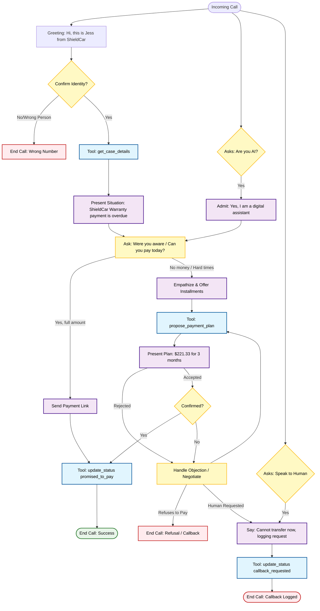

# Agent Voice Flow & POC Guide - ShieldCar Warranty

## 1. Flow Overview
The goal is a natural, empathetic negotiation for overdue payments on **ShieldCar Extended Vehicle Warranties**.

1.  **Greeting & ID**: Agent greets and confirms the customer's identity (Privacy First).
2.  **Context**: Agent states the calling reason (ShieldCar Warranty) and the pending amount/days overdue.
3.  **Discovery**: Agent asks about the payment situation ("Were you aware?", "What happened?").
4.  **Negotiation**:
    *   **Full Payment**: Offered first.
    *   **Installments**: Offered if full payment isn't possible (2-4 payments).
    *   **Settlement**: Last resort if needed (not primary path).
5.  **Agreement**: Agent re-states terms and asks for explicit confirmation ("Confirmed?").
6.  **Closing**: Agent logs the promise (`promised_to_pay`) and ends the call.

---

## 2. Process Flow Diagram (Mermaid)

---

## 3. Conversation Example (Happy Path)

**Context**: Renewing a ShieldCar Extended Warranty.

**Jess**: "Hi! This is Jess from **ShieldCar Warranty**. Am I speaking with the account holder?"
**Customer**: "Yes, that's me."
**Jess**: *(Calls get_customer_name)* "Perfect! Am I speaking with **Willian Martinez**?"
**Customer**: "Yes, that's me."
**Jess**: *(Calls get_case_details)* "I'm calling about your vehicle protection plan. I noticed a pending balance of **$664** for your warranty renewal, from about **7 days ago**. Were you aware of this?"
**Customer**: "Yes, but I can't pay it all right now."
**Jess**: "I completely understand. It happens. We want to make sure you stay covered against mechanical breakdowns. Could you handle it today in full, or would you prefer we divide it into **installments**?"
**Customer**: "I'd prefer installments."
**Jess**: "We can do it in 2, 3, or 4 payments, whatever works best for you."
**Customer**: "3 would work."
**Jess**: *(Calls propose_payment_plan)* "Perfect, that would be **$221.33** each. What dates work for you?"
**Customer**: "The 25th of each month."
**Jess**: "Excellent. So we're agreed on 3 installments of $221.33, starting December 25th. **Confirmed?**"
**Customer**: "Yes, confirmed."
**Jess**: *(Calls update_status)* "Perfect. I'll send you the confirmation via text in 2 minutes. Thank you for your time, Willian. Have a great day!"

---

## 4. Tools & Capabilities

| Tool | Function | Purpose |
| :--- | :--- | :--- |
| `get_customer_name` | **Identity Verification** | Retrieves name to confirm identity *before* discussing debt (Privacy). |
| `get_case_details` | **Context Retrieval** | Gets debt amount, overdue days, and risk level to personalize the pitch. |
| `propose_payment_plan` | **Calculator** | Calculates exact installment amounts or validates settlement offers in real-time. |
| `update_status` | **CRM Logging** | Logs the final outcome (`promised_to_pay`, `refused`, etc.) to the database. |

## 5. Why This POC Matters
*   **🎯 Non-Robotic**: Uses pauses, fillers ("um", "uh"), and empathy to sound human.
*   **💬 Natural Negotiation**: Adapts to the user's financial situation instead of demanding full payment.
*   **🔒 Privacy Compliant**: Never reveals debt info until the specific person is verified.
*   **📊 Data Driven**: Real-time integration with Supabase for accurate balances and status updates.

## 6. Test Data

| Name | Phone | Debt | Status |
| :--- | :--- | :--- | :--- |
| **Willian Martinez** | `+573124199685` | $664 (8 days o/d) | Active Test |
| **Mauricio Ordonez** | `+16787079207` | $850 (Due Dec 15) | Active Test |
| **Mauricio Cuevas** | `+16173653176` | $1,200 (Due Dec 20) | Active Test |
